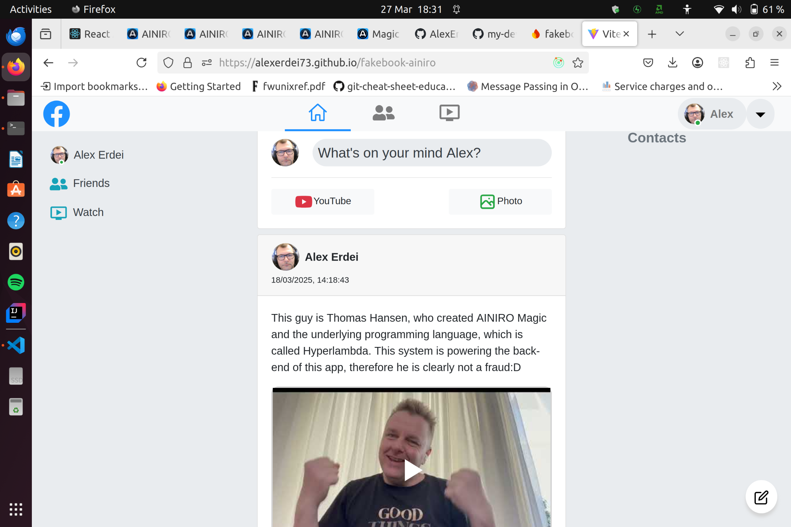

## Fakebook-AINIRO

This is a Facebook clone app, where the original version, which uses a Firebase
backend, can be found [here](https://github.com/AlexErdei73/fakebook). This
version is using [AINIRO Magic](https://docs.ainiro.io/), which is a low code,
no code backend framework from
[Thomas Hansen](https://www.linkedin.com/in/thomas-hansen-ainiro/). The
important bit of invention here is the Hyperlambda programming language, which
makes it possible for the machine to generate most of the backend code. It's a
simple, domain specific, functional programming language, which also human
readable too. You can find the Hyperlambda files in the folder here, although
these are only part of the backend project and run and stored in Magic. I put
them here for you to archive them. This project is a continuation of my previous
project with Magic, which is
[image-storage](https://github.com/AlexErdei73/image-storage).

